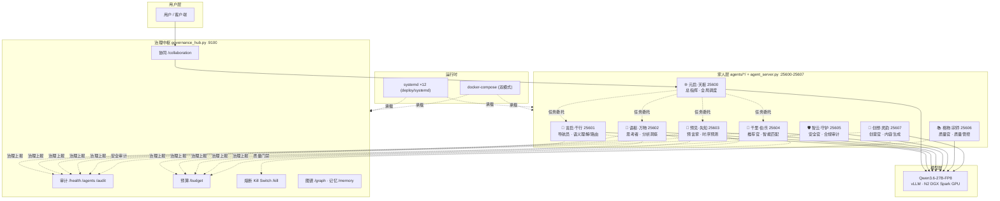

# 架构总览（ARCHITECTURE）

> YYC³ Family AI Agents — 1+8 拟人化协同智能体系统
> 本文档面向开发者，描述系统分层、数据流、部署拓扑与关键设计决策。

---

## 1. 系统分层

## 2. 关键组件

| 组件 | 入口 | 职责 | 状态 |
| ---- | ---- | ---- | ---- |
| 通用 Agent 服务 | `agent_server.py` | 单进程承载单家人：`/health /chat /metrics`，能力矩阵声明 + 模型降级 + 治理上报 | v3.1 生产 |
| 治理中枢 | `governance_hub.py` | 集中式治理：审计追踪、Token 预算、熔断、协同触发、上下文图谱、记忆 | v1.0.0 生产 |
| 身份体系 | `agents/<name>/{IDENTITY,SOUL,SYSTEM}.md` | 身份档案 / 灵魂设定 / 系统提示词（启动时加载） | 生产 |
| 部署体系 | `deploy/{install,ops,verify}.sh` + systemd ×12 | 前置检查 → 安装 → 自启 → 按序启动 → 拓扑注册 | 生产 |
| 提示词蓝图 | `docs/10-YYC3-提示词工程-企业蓝图/` | CO-STAR+CRAFT 规范、25 业务场景方法论、协议栈/可观测/安全设计 | 设计层 |
| 示例代码 | `examples/13-YYC3-企业蓝图-代码示例/` | 蓝图工程原型：MCP/A2A 客户端、零信任网关、telemetry SDK、规则引擎 | 参考（不接产线） |

## 3. 核心数据流

**对话流**：用户 → 治理中枢 `/collaboration`（触发条件命中）→ 天枢 `/chat`（路由决策）→ 目标家人 `/chat`（SYSTEM.md 身份注入 + Qwen3.6 推理）→ 响应 → 天枢/治理中枢审计上报（`correlation_id` 贯穿）。

**治理流**：各家人定期上报 `/audit/record`（行为）与 `/budget/record`（Token 消耗）→ 治理中枢聚合 → 异常触发 Kill Switch 或预算告警。

**部署流**：`install.sh` 前置检查（GPU/端口/依赖）→ 安装 systemd 单元 → `verify.sh` 端口/健康/端到端三段验证 → 拓扑注册到治理中枢。

## 4. 端口与拓扑约定

| 段 | 用途 |
| ---- | ---- |
| 3030+ | 开发服务器（团队规范 🚨） |
| 9100 | 治理中枢 |
| 25600-25607 | 8 位家人（env 可配，docker/systemd 双模式一致） |
| 8080 | 沙箱/模型端点（agent_server 内部调用） |

## 5. 设计决策记录（ADR 摘要）

| # | 决策 | 背景 | 取舍 |
| ---- | ---- | ---- | ---- |
| ADR-01 | 单模型 + 治理中枢集中式，而非蓝图多模型 + 协议栈分布式 | N2 DGX Spark 单机生产环境，GPU 显存约束 | 牺牲多模型冗余，换取运维简单与成本可控；降级链留待 P1 补齐 |
| ADR-02 | 身份提示词文件化（SYSTEM.md）而非硬编码 | 8 家人人格可独立演进、可版本管理 | 静态加载的实时性损失，待 P1 `/prompts` 模板服务补齐 |
| ADR-03 | 生产端口统一 25600 段，弃用原型 6000 段 | 避免与常用服务冲突；compose/systemd/env 三处一致 | 原型示例与生产端口不一致（examples 侧待外置化） |
| ADR-04 | 治理中枢独立进程而非内嵌各 Agent | 审计/预算/熔断需要全局视角与单点权威 | 中枢单点风险 → 由 systemd 自动重启 + 健康检查缓解 |

## 6. 演进路线

详见 [CHANGELOG「Unreleased」](CHANGELOG.md) 与
[分析报告第五章](docs/0379-family-ai-agents-trae-20260914/00-提示词体系与示例代码深度对比分析报告.md)：
P0 安全加固（零信任网关接入）→ P1 可观测+提示词模板化 → P2 A2A/MCP 协议栈与场景化智能。

---

> 「***YanYuCloudCube***」 · **© 2025-2026 YanYuCloudCube™. All Rights Reserved.**
