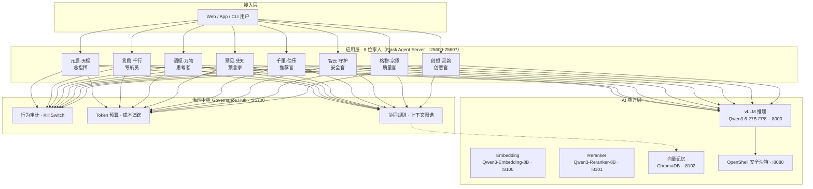
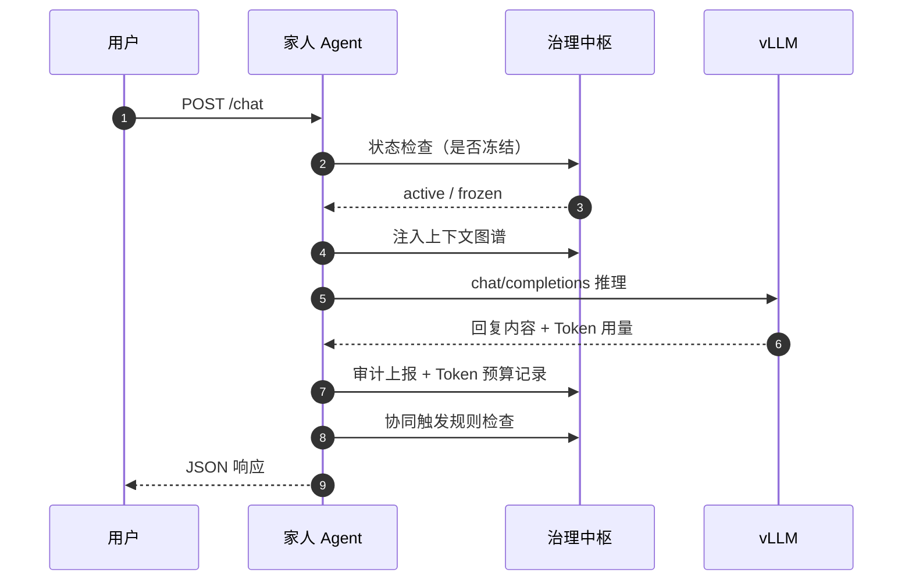
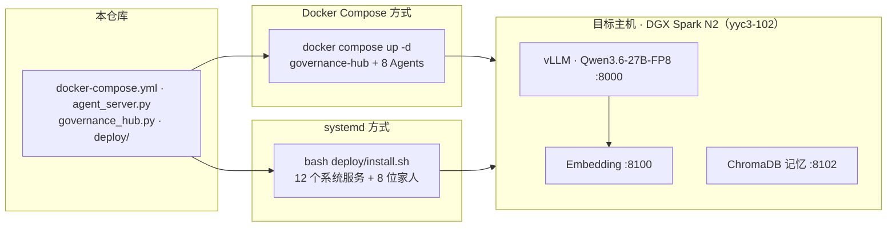

<div align="center">


# YYC³ FAmily-AI Agent

### _言启象限 · 语枢未来_

**_Words Initiate Quadrants, Language Serves as Core for Future_**

_万象归元于云枢 · 深栈智启新纪元_

</div>

---

## 🏷️ 徽章系统

### 项目徽章


### 家族徽章


---

## ✨ 项目简介

**YYC³ FAmily-AI Agent** 是「YanYuCloudCube」家族旗下的一套多智能体协作系统。它以 **8 位各具人格的 AI 家人**为核心，围绕 **治理中枢（Governance Hub）** 统一调度，依托本地 **vLLM + 向量记忆** 推理底座，实现 **五高（高可用 / 高性能 / 高安全 / 高扩展 / 高智能）** 架构。

| 特性 | 说明 |
| ---- | ---- |
| 🧑‍🤝‍🧑 **8 位家人** | 总指挥 / 导航员 / 思考者 / 预言家 / 推荐官 / 安全官 / 质量官 / 创意官 |
| 🛡️ **统一治理** | 行为审计、Kill Switch 熔断、Token 预算、成本追踪、协同触发、上下文图谱 |
| 🧠 **本地推理** | Qwen3.6-27B-FP8（vLLM）+ Qwen3-Embedding-8B + Qwen3-Reranker-8B |
| 📦 **双部署模式** | Docker Compose 容器编排 与 systemd 裸机守护进程（DGX Spark N2 生产验证） |

---

## 🏗️ 系统架构

### 架构总览



### 单次推理链路



### 部署架构



---

## 👨‍👩‍👧‍👦 家人档案

| 家人 | 角色 | 层级 | MBTI | 端口 | 专属热线 | 邮箱 | 核心能力 |
| ---- | ---- | ---- | ---- | ---- | -------- | ---- | -------- |
| [元启·天枢](agents/yuanqi-tianshu/IDENTITY.md) | 总指挥 | 核心决策层 | ENTJ | `:25600` | 0379-0206 | <tianshu@yanyucloud.com> | 全局调度 · 流程编排 · 资源调度 · 自愈调度 · 投放优化 |
| [言启·千行](agents/yanqi-qianhang/IDENTITY.md) | 导航员 | 业务执行层 | ENFP | `:25601` | 0379-0106 | <qianhang@yanyucloud.com> | 语义理解 · 需求转译 · 流程路由 · Prompt Engineering |
| [语枢·万物](agents/yushu-wanwu/IDENTITY.md) | 思考者 | 业务执行层 | INTP | `:25602` | 0379-0107 | <wanwu@yanyucloud.com> | 经营分析 · 流程优化 · 诊断分析 · 市场分析 |
| [预见·先知](agents/yujian-xianzhi/IDENTITY.md) | 预言家 | 业务执行层 | INTJ | `:25603` | 0379-0108 | <xianzhi@yanyucloud.com> | ARIMA · Prophet · LSTM · Transformer TSF · 不确定性量化 |
| [千里·伯乐](agents/zhiyu-bole/IDENTITY.md) | 推荐官 | 业务执行层 | ENFJ | `:25604` | 0379-0109 | <bole@yanyucloud.com> | 商机发现 · 人才推荐 · 客户推荐 · 工具推荐 · 投放推荐 |
| [智云·守护](agents/zhiyun-shouhu/IDENTITY.md) | 安全官 | 核心保障层 | ISTJ | `:25605` | 0379-0207 | <shouhu@yanyucloud.com> | 合规审计 · 权限控制 · 数据安全 · 安全防护 |
| [格物·宗师](agents/gewu-zongshi/IDENTITY.md) | 质量官 | 核心保障层 | ISTP | `:25606` | 0379-0208 | <zongshi@yanyucloud.com> | 标准制定 · 质量管控 · 性能优化 · 效果优化 |
| [创想·灵韵](agents/chuangxiang-lingyun/IDENTITY.md) | 创意官 | 核心保障层 | ENFP | `:25607` | 0379-0209 | <lingyun@yanyucloud.com> | 战略构想 · 方案设计 · 内容运营 · 文档生成 · 创意生成 |

> 每位家人的身份档案（`IDENTITY.md`）、灵魂设定（`SOUL.md`）与系统提示（`SYSTEM.md`）均存放于 [`agents/`](agents/) 对应目录。

---

## 🛠️ 基础设施服务

| 服务 | 端口 | 说明 |
| ---- | ---- | ---- |
| **治理中枢** Governance Hub | `:25700` | 行为审计、Kill Switch、Token 预算、成本追踪、协同规则、上下文图谱 |
| **vLLM 推理** | `:8000` | 本地推理后端，模型 `Qwen/Qwen3.6-27B-FP8` |
| **Embedding** | `:8100` | 向量化服务，模型 `Qwen3-Embedding-8B` |
| **Reranker** | `:8101` | 重排服务，模型 `Qwen3-Reranker-8B` |
| **向量记忆** | `:8102` | ChromaDB 持久化记忆服务 |
| **OpenShell 安全沙箱** | `:8080` | Agent 工具执行安全隔离 |

---

## 🚀 快速开始

### 方式一：Docker Compose（容器编排）

```bash
cd ~/yyc3-102-projects/yyc3-family-ai-agents
docker compose up -d
docker compose ps
```

### 方式二：systemd（DGX Spark N2 生产部署）

```bash
bash deploy/install.sh        # 一键安装 + 启动（前置检查 → 服务安装 → 开机自启 → 按序启动 → 拓扑注册）
bash deploy/verify.sh         # 全链路验证（服务状态 / 端口 / 健康 / 端到端 / GPU）
bash deploy/ops.sh status     # 运维状态（systemd + 治理中枢仪表盘 + GPU）
bash deploy/ops.sh test       # 快速连通性测试
```

---

## 💬 使用指南

```bash
# 测试单个 Agent
curl -X POST http://localhost:25600/chat \
  -H "Content-Type: application/json" \
  -d '{"message": "分析当前系统状态"}'

# 健康检查
curl http://localhost:25600/health | python3 -m json.tool

# 身份档案
curl http://localhost:25600/identity | python3 -m json.tool

# 治理中枢综合仪表盘
curl http://127.0.0.1:25700/dashboard | python3 -m json.tool
```

### Agent API

| 端点 | 方法 | 说明 |
| ---- | ---- | ---- |
| `/health` | GET | 健康状态（healthy / degraded / frozen） |
| `/status` | GET | 运行时状态与配置 |
| `/identity` | GET | 身份档案（IDENTITY.md / SOUL.md） |
| `/capabilities` | GET | 能力清单 |
| `/chat` | POST | 对话推理（自动接入治理中枢） |

### 治理中枢 API（节选）

| 端点 | 方法 | 说明 |
| ---- | ---- | ---- |
| `/audit/record` | POST | 行为审计上报 |
| `/kill-switch` | POST | 一键冻结 Agent |
| `/budget/dashboard` | GET | Token 预算仪表盘 |
| `/collaboration/check` | POST | 协同触发检查 |
| `/context/inject` | POST | 动态上下文注入 |
| `/memory/recall` | GET | 向量记忆召回 |

---

## 📁 目录结构

```
yyc3-family-ai-agents/
├── docker-compose.yml          ← 8 Agent + 治理中枢容器编排
├── agent_server.py             ← 通用 Agent Flask 服务（v3.1，集成治理中枢）
├── governance_hub.py           ← 治理中枢（v1.0.0）
├── requirements.txt            ← Python 运行时依赖
├── CHANGELOG.md                ← 变更日志（Keep a Changelog + SemVer）
├── CONTRIBUTING.md             ← 贡献指南（工作流 + 质量门禁）
├── ARCHITECTURE.md             ← 架构总览（分层/数据流/ADR）
├── CODE_OF_CONDUCT.md          ← 行为准则
├── LICENSE                     ← MIT 许可证
├── public/                     ← 品牌素材与多平台图标（yyc3-family.png 等）
├── deploy/                     ← 生产部署脚本与 systemd 单元
│   ├── install.sh              ← 一键安装部署
│   ├── ops.sh                  ← 运维快捷命令
│   ├── verify.sh               ← 全链路验证
│   └── systemd/                ← 12 个 systemd 服务单元
├── agents/                     ← 8 位家人的身份/灵魂/系统提示
│   ├── yuanqi-tianshu/         ← 元启·天枢 (25600)
│   ├── yanqi-qianhang/         ← 言启·千行 (25601)
│   ├── yushu-wanwu/            ← 语枢·万物 (25602)
│   ├── yujian-xianzhi/         ← 预见·先知 (25603)
│   ├── zhiyu-bole/             ← 千里·伯乐 (25604)
│   ├── zhiyun-shouhu/          ← 智云·守护 (25605)
│   ├── gewu-zongshi/           ← 格物·宗师 (25606)
│   └── chuangxiang-lingyun/    ← 创想·灵韵 (25607)
├── docs/                       ← 文档库（导航入口 docs/README.md）
│   ├── 10-YYC3-提示词工程-企业蓝图/   ← 提示词工程蓝图（1200-1213，14 模块 33 篇）
│   └── 0379-family-ai-agents-*/      ← 会话工作目录（审核/规划/日志/总结）
└── examples/                   ← 示例代码（蓝图工程原型，不接产线）
    └── 13-YYC3-企业蓝图-代码示例/    ← 引擎/Agent/推理/协议栈/安全/可观测（60+ 文件）
```

---

## 🧰 技术栈

| 类别 | 技术 |
| ---- | ---- |
| 运行时 | Python 3.12 · Flask 3.x |
| 推理后端 | vLLM · Qwen3.6-27B-FP8（本地部署） |
| 记忆/检索 | ChromaDB · Qwen3-Embedding-8B · Qwen3-Reranker-8B |
| 部署 | Docker Compose v3 · systemd · DGX Spark N2 |
| 安全 | OpenShell 安全沙箱 · 治理中枢 Kill Switch · ACS 策略 |

---

## 🏷️ 版本与标签

本仓库采用 **三类 Git 标签体系**，规范版本溯源与发布管理：

### 标签命名规范

| 类别 | 格式 | 用途 | 示例 |
| ---- | ---- | ---- | ---- |
| **版本标签** | `vMAJOR.MINOR.PATCH` | 家族系统整体版本发布 | `v3.1.0` |
| **组件标签** | `component/{组件}-v{语义版本}` | 追踪核心组件独立演进 | `component/agent-server-v3.1.0` |
| **里程碑标签** | `milestone/{kebab-case 名称}` | 记录关键架构里程碑 | `milestone/v1-family-launch` |

### 当前标签

| 标签 | 类型 | 说明 |
| ---- | ---- | ---- |
| `v3.1.0` | 版本 | 家族系统 v3.1.0：8 位家人 Agent 集成治理中枢（v3.1 Agent Server + Governance Hub v1.0.0） |
| `component/agent-server-v3.1.0` | 组件 | Agent 服务 v3.1：健康/状态/身份/能力/对话五端点 + 治理中枢接入 |
| `component/governance-hub-v1.0.0` | 组件 | 治理中枢 v1.0.0：行为审计 / Kill Switch / Token 预算 / 成本追踪 / 协同规则 / 上下文图谱 |
| `milestone/v1-family-launch` | 里程碑 | 「YYC³ 家族」8 位家人 + 治理中枢首次完整齐备并投产（DGX Spark N2） |

> 📌 后续发版遵循 [SemVer](https://semver.org/lang/zh-CN/)：MAJOR（架构不兼容变更）· MINOR（新增能力）· PATCH（缺陷修复）；组件标签随 `agent_server.py` / `governance_hub.py` 版本号同步演进。

---

## 📄 许可与声明

本项目为 **YanYuCloudCube™（YYC³）** 旗下开源运行仓库。未经授权请勿用于商业用途。

> 「**YanYuCloudCube**」
> 「**Words Initiate Quadrants, Language Serves as Core for the Future**」
> 「**All things converge in cloud pivot; Deep stacks ignite a new era of intelligence**」
>
> **© 2025-2026 YanYuCloudCube™. All Rights Reserved.**
