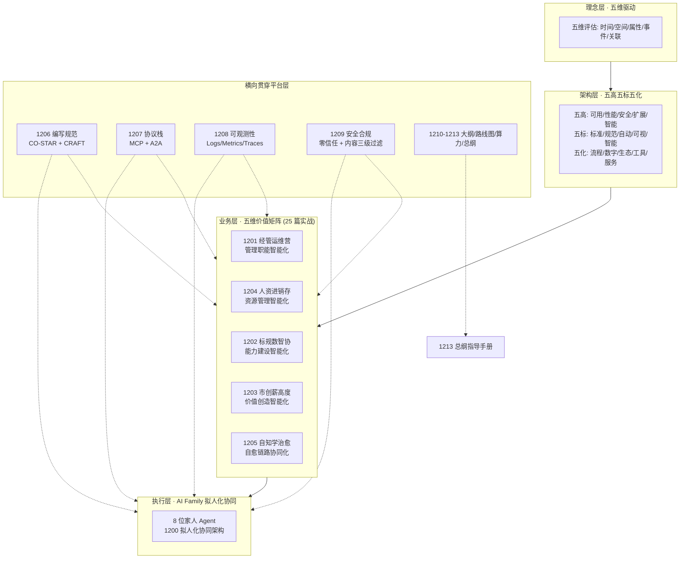
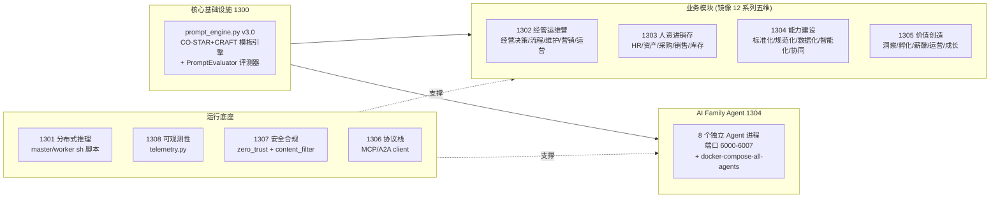
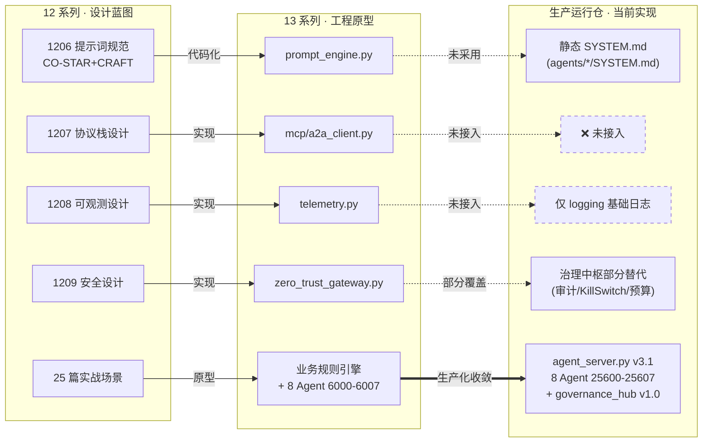
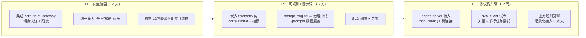
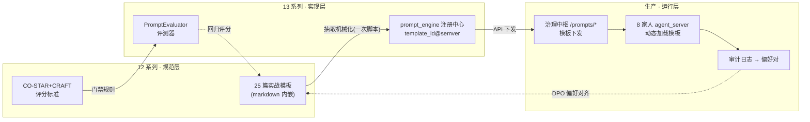

# 📊 提示词体系与示例代码深度对比分析报告

> 审计范围：`docs/10-YYC3-提示词工程-企业蓝图`（33 篇文档）× `examples/13-YYC3-企业蓝图-代码示例`（60+ 文件）× 生产运行仓（`agent_server.py` / `governance_hub.py`）
> 审计原则：不盲猜、不盲从 —— 全部结论基于原始文档与代码引用

---

## 一、12 系列提示词体系：核心架构梳理

### 1.1 四层架构全景

### 1.2 设计原则（文档实证）

| 原则 | 文档出处 | 核心内容 |
| ---- | ---- | ---- |
| **双框架提示词规范** | [1206/README.md](file:///Users/yanyu/YYC-Cube/YYC3-Family-AI-Agents/12-YYC3-提示词工程-企业蓝图/1206-提示词工程-蓝图实战-编写规范/README.md) | CO-STAR 六要素（Context/Objective/Scope/Task/Audience/Response）+ 权重评分（Task 25% / Objective·Response 20% / Context 15% / Scope·Audience 10%），**通过线 ≥ 80%**；CRAFT 强调工程化、可复用、可评测 |
| **拟人化协同范式** | [1200](file:///Users/yanyu/YYC-Cube/YYC3-Family-AI-Agents/12-YYC3-提示词工程-企业蓝图/1200-提示词工程-AI-FAmily-Agent-拟人化协同架构.md) | 三段范式演进：单体 LLM → 专业化 Agent 流水线 → **家庭式协同**；创新点：人格化命名、平等对话、共同成长、情感交互、多维治理 |
| **双协议标准化** | [1207/README.md](file:///Users/yanyu/YYC-Cube/YYC3-Family-AI-Agents/12-YYC3-提示词工程-企业蓝图/1207-提示词工程-蓝图实战-协议栈标准化设计/README.md) | MCP（Agent↔Tool，「AI 的 USB-C」，Streamable HTTP+stdio）+ A2A（Agent↔Agent，「外交语言」，gRPC+JSON-RPC），均由 Linux Foundation 治理 |
| **三支柱可观测** | [1208/README.md](file:///Users/yanyu/YYC-Cube/YYC3-Family-AI-Agents/12-YYC3-提示词工程-企业蓝图/1208-提示词工程-蓝图实战-全栈可观测性架构/README.md) | Logs（Loki/correlationId）+ Metrics（Prometheus/Token 消耗）+ Traces（OTel/Jaeger），采集层统一 OpenTelemetry Collector |
| **四层安全防护** | [1209/README.md](file:///Users/yanyu/YYC-Cube/YYC3-Family-AI-Agents/12-YYC3-提示词工程-企业蓝图/1209-提示词工程-蓝图实战-安全合规与伦理治理/README.md) | 入口防护（提示词注入检测）→ 访问控制（零信任+RBAC/ABAC）→ 运行时防护（内容三级过滤）→ 治理审计（ISO 42001），智云守护全程贯穿 |
| **管理思维融合** | [1201 系列](file:///Users/yanyu/YYC-Cube/YYC3-Family-AI-Agents/12-YYC3-提示词工程-企业蓝图/1201-提示词工程-蓝图实战-管理职能智能化/120101-提示词工程-蓝图实战-管理职能-经营决策智能化.md) | 每篇实战文档绑定「My 管理思维」准则（如经营决策↔「认知信任为极致」）+ Agent 分工表 + 技术路径（ETL→指标→异常检测→RAG 生成→质量审核）+ Five S 提示词模板 |

### 1.3 应用场景覆盖

- **25 个业务场景**：5 大系列 × 5 场景（经营决策/人力资源/标准化体系/市场洞察/系统自愈等），每场景均有「Agent 分工 + 技术实现路径 + 提示词模板」三段式落地指南
- **基础设施场景**：7 台设备算力矩阵（N1/N2 DGX、yyc3-22/77/45/66/33）、端口规划、存储分层、DPO 训练调度（[1213 总纲](file:///Users/yanyu/YYC-Cube/YYC3-Family-AI-Agents/12-YYC3-提示词工程-企业蓝图/1213-提示词工程-企业蓝图-总纲指导手册.md)）
- **治理场景**：Token 预算、行为审计、Kill Switch、协同触发（与生产仓治理中枢同构）

---

## 二、13 系列示例代码：实现逻辑剖析

### 2.1 技术选型

| 层面 | 选型 | 证据 |
| ---- | ---- | ---- |
| Web 框架 | Flask（同步） | `yanqi_agent.py: from flask import Flask, request, jsonify` |
| 推理后端 | 多模型矩阵 GLM-6 / Qwen-4.0 / DeepSeek-V3 | `yanqi_agent.py MODEL_CONFIG = {"primary": "qwen-4.0", "fallback": ["glm-6", "deepseek-v3"]}` |
| 协议 | MCP + A2A 自研轻量客户端（aiohttp 异步） | `mcp_client.py: MCPTransportType.STREAMABLE_HTTP/STDIO` |
| 安全 | 零信任网关（API_KEY/JWT/HMAC/mTLS 四种认证） | `zero_trust_gateway.py: AuthMethod, PermissionCategory` |
| 可观测 | 自研 OTel 风格 SDK（批量日志/指标/追踪） | `telemetry.py: StructuredLogger + SENSITIVE_FIELDS 脱敏` |
| 业务引擎 | **纯 Python 规则引擎（无 LLM 依赖）** | `business_decision_inference.py: 加权评分 overall_health_score` |

### 2.2 功能模块划分（60+ 文件 → 9 大模块）

### 2.3 关键实现亮点

1. **能力矩阵 + SLO + 降级链**（[yanqi_agent.py](file:///Users/yanyu/YYC-Cube/YYC3-Family-AI-Agents/13-YYC3-企业蓝图-代码示例/1304-代码示例-AI-Family-Agent/言启-千行导航员/yanqi_agent.py)）：8 Agent 各自声明 `capabilities`、`slo{availability, latency_p99}`、`fallback` 兜底对象（如智云·守护 availability 0.999 / p99 2000ms / 无 fallback）
2. **优雅降级导入**：`try: from A2A.a2a_client import ... except ImportError: A2AClient = None` —— 协议栈可选，不阻断主流程
3. **双框架代码化**（[prompt_engine.py](file:///Users/yanyu/YYC-Cube/YYC3-Family-AI-Agents/13-YYC3-企业蓝图-代码示例/1300-代码示例-核心基础设施/prompt-engine/prompt_engine.py)）：`COSTARPrompt.to_prompt()` / `CRAFTPrompt.to_prompt()` 将 1206 规范转为可执行数据类；`PromptEvaluator` 五维评分（clarity 25%/specificity 20%/completeness 20%/safety 20%/effectiveness 15%）
4. **权限模型对齐五维矩阵**（[zero_trust_gateway.py](file:///Users/yanyu/YYC-Cube/YYC3-Family-AI-Agents/13-YYC3-企业蓝图-代码示例/1307-代码示例-安全合规/zero_trust_gateway.py)）：`PermissionCategory = {DECISION, RESOURCE, CAPABILITY, VALUE, HEALING, SYSTEM, SECURITY, OBSERVABILITY}` —— 与 12 系列五维价值矩阵**一一映射**，设计与代码同源
5. **脱敏日志**（telemetry.py）：`SENSITIVE_FIELDS = {password, token, api_key, id_card, phone, email, bank_account...}` 自动脱敏
6. **业务模块为规则引擎原型**：`business_decision_inference.py` 的健康分 = `min(利润率,30)/30*40 + min(增长率,20)/20*30 + 效率/100*30`，趋势预测基于滑动均值——**确定性可测试，但未接入 LLM**

---

## 三、文档 × 代码 × 生产仓 三方对比

### 3.1 协同机制（设计 → 原型 → 生产演进链）

**演进逻辑**：12 系列定义「应然」，13 系列验证「可行」，生产仓收敛「实然」。生产仓选择了**单模型（Qwen3.6-27B-FP8）+ 治理中枢集中式**路线，而非蓝图的**多模型 + 协议栈分布式**路线——这是面向 DGX Spark N2 单机生产环境的合理工程取舍。

### 3.2 逐项对照矩阵

| 维度 | 12 蓝图 | 13 原型 | 生产仓现状 | 差距评级 |
| ---- | ---- | ---- | ---- | ---- |
| Agent 端口 | 端口规划（1212） | 6000-6007 | **25600-25607**（docker-compose/systemd） | ✅ 已收敛（env 可配） |
| 模型策略 | GLM-6/Qwen-4.0/DeepSeek-V3 多模型 | primary qwen-4.0 + fallback | 单模型 Qwen3.6-27B-FP8 + vLLM | ⚠️ 无 fallback 链 |
| 提示词管理 | CO-STAR+CRAFT 规范 + 评分 | PromptEngine 模板化 + 评测器 | **静态 SYSTEM.md 文件加载** | 🔴 P1 |
| Agent 通信 | A2A 协议（任务委托/多轮协商） | A2AClient 可用 | **HTTP 直连无协议层** | 🔴 P2 |
| 工具连接 | MCP（工具发现/资源/模板） | MCPClient 可用 | **无**（沙箱 :8080 直连） | 🔴 P2 |
| 认证授权 | 零信任四层防护 | ZeroTrustGateway 完整实现 | **Flask 端点全部无认证** | 🔴 P0 |
| 行为审计 | 治理审计层 | — | ✅ 治理中枢 `/audit/record` + trail | ✅ 领先原型 |
| 成本治理 | Token 预算（1213 体系） | — | ✅ `/budget/record` + dashboard | ✅ 领先原型 |
| 熔断降级 | Kill Switch + fallback 链 | fallback 矩阵 | ✅ Kill Switch（无自动 fallback） | ⚠️ 半覆盖 |
| 可观测 | 三支柱 + OTel | telemetry.py SDK | `logging.basicConfig` 基础日志 | 🔴 P1 |
| 业务场景 | 25 篇实战方法论 | 规则引擎原型 ×25 | 未承载业务模块（通用对话） | ⚠️ 定位差异 |

### 3.3 命名漂移审计（知遇 vs 千里）— ✅ 已修复（2026-09-14）

| 来源 | 修复前 | 修复后 |
| ---- | ---- | ---- |
| 12/13 蓝图层（55 文件 190 处） | **知遇·伯乐**（历史旧称） | ✅ 统一为「千里·伯乐」（含 zhiyu→qianli 拼音标识、目录名「知遇-伯乐推荐官→千里-伯乐推荐官」） |
| 生产 README + agents 文档 | **千里·伯乐** | ✅ 保持（权威事实源：agents/zhiyu-bole/SYSTEM.md 自称千里·伯乐） |
| 1200 ASCII 协同图 | 知遇/伯乐 竖排拆分 | ✅ 已改千里/伯乐（保持对齐） |

> **裁决依据**：生产层 agents/*/SYSTEM.md、SOUL.md、deploy/systemd 全部使用「千里·伯乐」，且座右铭「万千人中识得千里马」语义绑定「千里」；蓝图层 190 处旧称为历史遗留。修复脚本：[rename_bole.py](rename_bole.py)。

### 3.4 12 系列 README 索引漂移 — ✅ 已修复（2026-09-14）

[12/README.md](file:///Users/yanyu/YYC-Cube/YYC3-Family-AI-Agents/12-YYC3-提示词工程-企业蓝图/README.md) 修复前模块总览表 `1202=资源管理/1203=能力建设/1204=价值创造` 与实际目录错位，且 `1206=算力资源分配.md` 不存在（算力内容在 1212）。✅ 已按实际目录结构 + 1213 总纲校正：1202=能力建设/1203=价值创造/1204=资源管理，并补全 1206-1213 共 8 个横向贯穿与治理层模块行（7 模块 → 14 模块，26 篇 → 33 篇），详细索引区 1202/1203/1204 小节同步重排。

---

## 四、五维评估与综合评分

| 维度 | 12 蓝图 | 13 原型 | 生产仓 | 说明 |
| ---- | ---- | ---- | ---- | ---- |
| **时间维** | 85 | 75 | 80 | 蓝图有四阶段路线图；原型延迟指标完整（p99）；生产仓有 latency 上报但无 SLO 告警 |
| **空间维** | 90 | 80 | 85 | 蓝图 7 设备矩阵+存储分层；生产仓单机收敛但双部署模式成熟 |
| **属性维** | 90 | 80 | 70 | 安全设计完备；原型零信任可用；生产仓端点裸奔是最大短板 |
| **事件维** | 85 | 70 | 85 | 生产仓审计/协同触发/KillSwitch 事件链最完整（超越原型） |
| **关联维** | 95 | 75 | 60 | 蓝图 MCP/A2A 关联设计最强；生产仓缺协议层、上下文图谱仅内部 |
| **总分** | **89** | **76** | **76** | 设计优秀、原型完备、生产收敛但「安全+可观测+协议」三大平台能力未随行 |

---

## 五、适用性、可复用性与优化路线

### 5.1 可复用性评估（13 → 生产仓直接可用资产）

| 资产 | 复用方式 | 成本 | 收益 |
| ---- | ---- | ---- | ---- |
| `telemetry.py` | 直接嵌入 agent_server（装饰器 `@telemetry.trace`） | 低 | 立获三支柱可观测 + 脱敏 |
| `zero_trust_gateway.py` | 以 `@gateway.require()` 包裹 Flask 端点 | 低 | 补齐 P0 安全缺口 |
| `prompt_engine.py` | 挂接治理中枢新端点 `/prompts/*` 实现模板化下发 | 中 | SYSTEM.md 静态 → 动态模板 + 质量评测 |
| `AGENT_CAPABILITY_MATRIX` 设计 | 迁入 governance_hub 作为 `/collaboration` 决策依据 | 中 | 自动 fallback + SLO 路由 |
| 业务规则引擎 ×25 | 作为各家人 `/chat` 的结构化前置/后置处理 | 中高 | 从通用对话升级为场景化智能 |

### 5.2 优化路线图

### 5.3 结论

1. **体系完整性**：12 系列「理念→架构→业务→执行」四层闭环 + 平台横切设计严谨（89 分），是稀缺的企业级 Agent 工程方法论资产
2. **原型价值**：13 系列完成蓝图代码化验证，其中零信任/可观测/提示词引擎三件套**生产可用**，直接复用可零风险补齐生产仓平台短板
3. **生产仓定位准确**：治理中枢（审计/预算/熔断/协同/图谱/记忆 25 端点）是超越蓝图原型的**自研亮点**，事件维得分最高
4. **核心缺口**：安全认证（P0）> 可观测（P1）≈ 提示词动态化（P1）> 协议栈（P2），均为「蓝图已有、原型已验、生产未接」状态——**优化空间清晰且路径明确**

---

## 六、评分提升途径与最优融合执行方案（v1.1 追加）

### 6.1 12 系列提分路径（89 → 94+）

| # | 提升项 | 现状证据 | 执行动作 | 五维增益 |
| -- | ------ | -------- | -------- | -------- |
| 1 | **索引一致性治理** | README 总览表 `1202=资源管理` 与实际目录 `1202=能力建设` 错位；`1206=算力资源分配.md` 不存在 | 以 1213 总纲为唯一事实源重写 README 索引表 | 关联维 95→98 |
| 2 | **命名归一** | 「知遇·伯乐」（12/13 层 55 处）vs「千里·伯乐」（生产 agents/*/SYSTEM.md、README、deploy） | 建立《家人命名注册表》，以生产层为基准全局归一 | 关联维 +2 |
| 3 | **框架统一** | 1206 定义 CO-STAR+CRAFT，但 120101 实战用 Five S —— 三框架并存 | Five S 降级为 CO-STAR 兼容别名（Set the Scene→Context+Audience 等映射），25 篇模板统一迁移 | 属性维 90→93 |
| 4 | **提示词资产化** | 25 篇状态全部「🔄 优化中」，模板内嵌 markdown 无版本 | 模板抽离为 `template_id + semver + changelog`（如 `120101-business-insight@v2.0`），文档只留引用 | 时间维 85→90 |
| 5 | **评测闭环** | 1206 有评分标准（≥80% 通过线）但无执行载体；13 的 `PromptEvaluator` 未回连 | 每篇模板附 golden 测试集，评分标准从"文档描述"变为"CI 门禁" | 事件维 85→90 |

> DPO 回路：治理中枢审计日志 → 偏好对 → DPO 训练（1213 已规划 N2 训练）→ 提示词迭代，补齐 1206「提示词全生命周期」最后一环。

### 6.2 13 系列提分路径（76 → 87+）

| # | 提升项 | 现状证据 | 执行动作 | 五维增益 |
| -- | ------ | -------- | -------- | -------- |
| 1 | **业务引擎接入 LLM** | `business_decision_inference.py` 纯规则加权评分，无一次模型调用 | 规则引擎降为护栏层（guardrail）：LLM 负责洞察生成，规则负责数值校验与兜底 | 关联维 75→85 |
| 2 | **平台件自用** | yanqi_agent 仅 try/except 导入协议栈，telemetry/zero_trust 零接入 | 8 个 Agent 统一 `@telemetry.trace` + `@gateway.require()` 装饰（各 2 行改动） | 属性维 80→90 |
| 3 | **消除 v1/v2 双轨** | `business_decision_api.py` 与 `_v2.py` 并存 | v1 标记 deprecated 删除，git 历史即版本 | 空间维 80→85 |
| 4 | **配置外置 + 打包** | 端口 `6000-6007`、endpoint 硬编码；无 requirements.txt | env/config 外置 + 补依赖清单，与生产 `25600-25607` 端口规范对齐 | 时间维 75→82 |
| 5 | **测试贯通** | `test_yyc3_*.py` 覆盖业务引擎但未覆盖 prompt 与协议栈 | 增加 prompt 回归测试（模板变更 → golden 集跑分） | 事件维 70→78 |

### 6.3 最优融合执行方案：「蓝图即代码」双向管线

融合本质不是「12+13 合并」，而是建立 **S（12 规范）→ I（13 实现）→ P（生产部署）** 的可验证管线：

**最优执行顺序**（依赖驱动，前步解锁后步）：

1. **P0 一致性修复**（半天）：索引校正 + 命名归一 —— 不做此步，后续 template_id 映射会建立在错误名称上 ✅ 本次已执行
2. **模板抽取**（1 天）：脚本扫描 25 篇文档提示词块 → 按 `文档编号-场景` 生成 template_id 注入 prompt_engine 注册中心 —— 纯机械操作，零设计成本
3. **双向接通**（2-3 天）：治理中枢新增 `/prompts/list|get|evaluate` 三端点（复用现有 25 端点 Flask 模式）；agent_server `/chat` 从「静态 SYSTEM.md」升级为「身份(SYSTEM.md) + 任务模板(prompt_engine)」双层注入
4. **闭环点火**（持续）：生产审计日志按 `correlation_id` 聚合 → 低分响应进 golden 集负样本 → DPO 训练 → 模板修订走 12 系列文档变更流程

**融合后预期**：12 系列 89→94（资产化+闭环），13 系列 76→87（自用+LLM 接入），生产仓 76→85+（平台三件套随行），三方从「松耦合演进」变为「单管线强一致」。

---

**审计结论**: 有条件通过 —— 设计与原型质量优秀，生产仓需按 P0→P2 路线完成平台能力补齐
**下次审核建议**: P0 完成后复核安全基线
